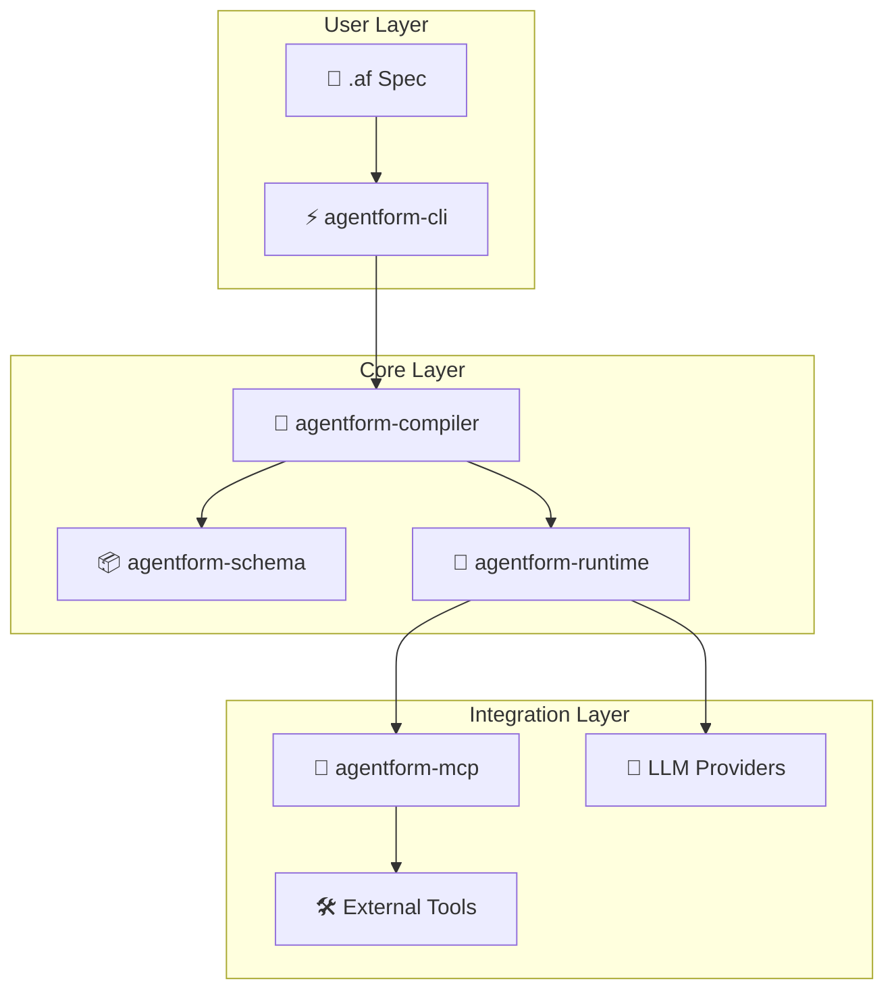

# Core Concepts

Agentform is built as a modular system with five core packages, each with a specific responsibility.

## System Overview

## Core Packages

| Package | Description |
|---------|-------------|
| **agentform-schema** | Core Pydantic models for specs and Intermediate Representation |
| **agentform-compiler** | Parses `.af` files, validates specs, and generates IR for the runtime |
| **agentform-runtime** | Workflow execution engine with LLM integration and policy enforcement |
| **agentform-mcp** | MCP (Model Context Protocol) client for connecting to external tool servers |
| **agentform-cli** | Command-line interface for validating and running workflows |

## Package Details

### agentform-schema

The foundation of Agentform, providing:
- Type-safe data models for all Agentform constructs
- Intermediate Representation (IR) schema
- Validation rules and constraints
